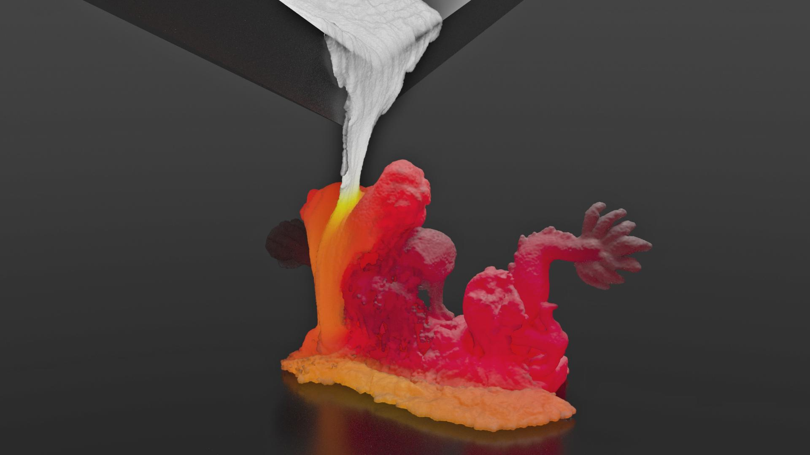

# GPU Optimization of Material Point Methods 

[Ming Gao](http://pages.cs.wisc.edu/~mingg13/)\*, 
[Xinlei Wang](https://github.com/littlemine)\*, 
[Kui Wu](http://www.cs.utah.edu/~kwu/)\* (\*joint first authors), 
Andre Pradhana, 
[Eftychios Sifakis](http://pages.cs.wisc.edu/~sifakis/), 
[Cem Yuksel](http://www.cemyuksel.com/), 
[Chenfanfu Jiang](https://www.seas.upenn.edu/~cffjiang/)

*ACM Transactions on Graphics (Proceedings of SIGGRAPH ASIA 2018), 37, 6, 2018*



## Abstract

The Material Point Method (MPM) has been shown to facilitate effective simulations of physically complex and topologically challenging materials, with a wealth of emerging applications in computational engineering and visual computing. Borne out of the extreme importance of regularity, MPM is given attractive parallelization opportunities on high-performance modern multiprocessors. Parallelization of MPM that fully leverages computing resources presents challenges that require exploring an extensive design-space for favorable data structures and algorithms. Unlike the conceptually simple CPU parallelization, where the coarse partition of tasks can be easily applied, it takes greater effort to reach the GPU hardware saturation due to its manycore SIMT architecture. In this paper we introduce methods for addressing the computational challenges of MPM and extending the capabilities of general simulation systems based on MPM, particularly concentrating on GPU  optimization. In addition to our open-source high-performance framework, we also conduct performance analyses and benchmark experiments to compare against alternative design choices which may superficially appear to be reasonable, but can suffer from suboptimal performance in practice. Our explicit and fully implicit GPU MPM solvers are further equipped with a Moving Least Squares MPM heat solver and a novel sand constitutive model to enable fast simulations of a wide range of materials. We demonstrate that more than an order of magnitude performance improvement can be achieved with our GPU solvers. Practical high-resolution examples with up to ten million particles run in less than one minute per frame.

PAPER \[[pdf](http://www.cs.utah.edu/~kwu/GPU_MPM/GPU_MPM.pdf)\] 
===========

Video \[[Youtube](https://youtu.be/xTUSFn67U_I)\]
===========

DESCRIPTION
===========

This package provides a full pipeline of material point method (MPM) on the GPU with sparse grid structure, 
including three particle-to-grid and grid-to-particle tranfer schemes, FLIP, APIC, and MLS, 
and both implicit and explicit solver. 

The entire MPM simulator consists of four modules: **Model**, **ParticleGridTransformer**, **Grid** and **MPMTimeIntegrator**.
* Model. Composed of a **Particle** and several **Materials** (only fixed corotated material in current release version). Manages particle and material data. Maintain the order of particles before every timestep.
* Grid. Manages grid data through the sparse grid data structure. Initialize (clear) the grid before every timestep.
* ParticleGridTransformer. Establish the topology among sparse grid blocks, build the mapping between particles and grid blocks, etc.
* MPMTimeIntegrator. Executes the pipeline during every time step, including data transfer between particles and the grid, the integration over the grid, etc. The time integration can either be explicit or implicit, and its transfer scheme can be FLIP, APIC or MLS.

We compute SVD "on-the-fly" and use modified histogram sort for particle sorting.

More configuration options are in **CONFIGURATION** section.

**Note: this software is released under the GPLv3.0 license. For commercial use, please email authors for negotiation.**

Requirements
============

Basic requirements: CMake 3.0\ CUDA 8.0+\ C++14 C++ compiler

Hardware requirements: SM_6X (Pascal) GPUs and newer SM architectures

Support platforms: windows 10\ Ubuntu 16.04+

Standalone matrix 3x3 SVD code
============

https://github.com/kuiwuchn/3x3_SVD_CUDA

COMPILING & RUNNING
===================

**Under "src" directory,**

For Linux, 
1. Create folder "Build"
2. Rename "CMakeLists-linux.txt" to "CMakeLists.txt"
3. Open "CMakeLists.txt" (including the ones in subdirectory "Cpp17Build" and "CudaBuild"), and update Cuda toolkits, Partio and C++ Compiler settings (e.g. from line 19 to 28 of the CMake file in the root directory). 
4. Compile using CMake toolchain. Enter the "Build" directory and run command "cmake ../ && make && ./mpm"
5. Copy "Assets" folder into "Build"
6. Run mpm under "Build"

For Windows:

1. Create folder "Build"
2. Rename "CMakeLists-VS15.txt" as "CMakeLists.txt"
3. Update "include_directories" and "link_directories" in "CMakeLists.txt" with Cuda toolkits and Partio from line 21 to 24.
4. Compile project in Visual Studio
5. Copy "Assets" folder into "Build"
6. Run p2g_cuda.exe under "Build/Release"

The program will write the simulation data in .bego format. You can check it in Houndini.
Note that the windows verison code is only tested in VS15.

CONFIGURATION
=============

Configure by changing Setting.h and configurable settings (macros) are:

N - Domain resolution N^3

MPM_SIM_TYPE - explicit (0) and implicit (1)

TRANSFER_SCHEME  - FLIP (0), APIC (1), and MLS (2)

GEOMETRY_TYPE - large dropping cube (0) and two colliding dragons (1). 

## BibTex 

Please cite the following paper if it helps. 

```
@article{Gao:2018:GPU_MPM,
 author       = {Ming Gao* and Xinlei Wang* and Kui Wu* and Andre Pradhana and Eftychios Sifakis and Cem Yuksel and Chenfanfu Jiang},
 title        = {GPU Optimization of Material Point Methods},
 journal      = {ACM Transactions on Graphics (Proceedings of SIGGRAPH ASIA 2018)},
 volume       = {37},  
 number       = {6},  
 year         = {2018},   
 publisher    = {ACM Press},
 address      = {New York, NY, USA},
 note         = {(*Joint First Authors)},
}  
```
EXTERNAL CREDITS
================

This work utilizes the following external software library, which have been included here for convenience:
Copyrights are retained by the original authors.

Partio https://github.com/wdas/partio

Sample Elimination http://www.cemyuksel.com/cyCodeBase/soln/poisson_disk_sampling.html 
